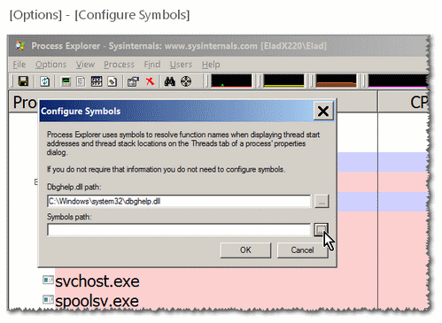

<h1>Symbols</h1>

Symbols folder fill with a lot of PDB. 

Visual Studio 8+10 + Windows SDK 7.1 + DirectX + .NET SDK + ICM Symbols + VB + VC . 

Used for debug purposes. 

Can be used with various debuggers and Windows Sysinternals' Process Explorer to see API calls/threads etc...

There is no default place, but various installers (Windows SDK, .NET and Visual-Studio) tend to place it under <code>C:\Windows\</code> (<code>%SystemRoot%</code>), so you can place it there, if there is already a folder that name there, you can add this repository's content to it (don't overwrite existing files). You don't have to place it in a sub-folder named <code>dll</code>, but this is how Visual-Studio likes it it is an internal thing.. so you better place it in the same naming too way too...

